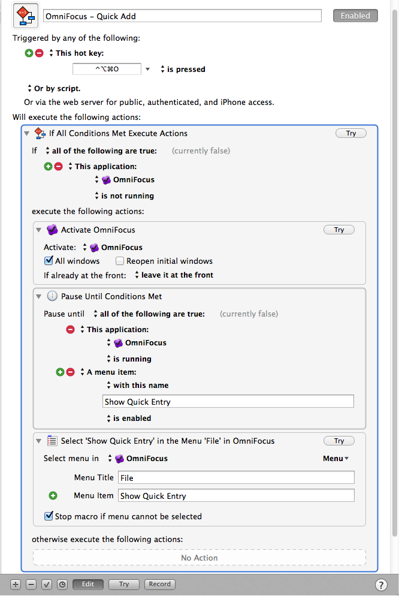

km-omnifocus-launch-quick-entry
===============================

Keyboard Maestro macro to launch OmniFocus' quick entry, even if OmniFocus isn't running

On [Mac Power Users 181](http://www.macpowerusers.com/2014/03/09/mac-power-users-181-automation-workflows-with-tj-luoma/), I mentioned that I have a keyboard shortcut for OmniFocus’ “Quick Entry” which works even if OmniFocus isn’t running. [Tom Siko](https://twitter.com/tcsiko/status/443803903818072064) asked if I’d be willing to share it, so here it is.

*Even if you don’t use OmniFocus,* this idea can be re-used for just about any application that you run via keyboard trigger, such as [Skitch](http://evernote.com/skitch/) (or, my preference, [Skitch 1](http://evernote.com/download/get.php?file=SkitchMac_v1)).

The idea is fairly simple: you have this keyboard shortcut in your head, such as <kbd>⌘</kbd>+<kbd>⇧</kbd>+<kbd>5</kbd> for Skitch, or <kbd>⌘</kbd>+<kbd>⇧</kbd>+<kbd>O</kbd> for OmniFocus. Over time, you learn that whenever you want to do *{thing}* you press *{these keys}*. But there’s one problem: those keyboard shortcuts only work if the app is running. So what do you do? Keep all of those apps running all of the time, just in case you might want to use them? That’s an option, but it’s an option I’d rather avoid if I can.

Instead, I’d rather use Keyboard Maestro, which I already have running all of the time anyway (and it runs in the menu bar out of the way), and have *it* watch for when I press *{these keys}*. Inside Keyboard Maestro, I create a simple “if/else” that says:

If _YourApp_ is not running:

*	Launch it
*	Pause until it is running
* 	Activate _YourApp_
* 	Trigger the desired action

Else (that is, if _YourApp_ is running):

* 	{This section intentionally left blank}
 	
### “Yeah yeah, I get the idea, show me how you do it…”

Here is my Keyboard Maestro for Skitch:

Notice that I have told the macro to wait until Skitch is running, and until it finds the menu item for “Crosshair Snapshot” (which is the menu item equivalent to <kbd>⌘</kbd>+<kbd>⇧</kbd>+<kbd>5</kbd>), and then I tell it to use that menu item.

Since the “otherwise execute the following actions” area is _blank_, when I press <kbd>⌘</kbd>+<kbd>⇧</kbd>+<kbd>5</kbd> when Skitch _is_ running, Keyboard Maestro won’t do anything, which means that the keyboard shortcut gets passed on to Skitch, as usual.

### OmniFocus ###

My keyboard shortcut for OmniFocus Quick Entry is <kbd>⌃</kbd> + <kbd>⌥</kbd>  + <kbd>⌘</kbd> + <kbd>O</kbd>, which might sound crazy, but as I explained on MPU, I have set my ***right*** <kbd>⌥</kbd>  key and <kbd>Caps Lock</kbd> to equal <kbd>⌃</kbd> + <kbd>⌥</kbd>  + <kbd>⌘</kbd>, so when I want to add something to OmniFocus, I press <kbd>Caps Lock</kbd> + <kbd>O</kbd> or <kbd>Option_R</kbd> + <kbd>O</kbd>.

The key is to make sure that whatever keyboard shortcut you have in OmniFocus’ preferences here:

matches whatever you use in the associated Keyboard Maestro macro.

Same idea as before: if OmniFocus is _not_ running, activate it, pause until it is running and a “Show Quick Entry” menu item exists, and then select the menu item.

If OmniFocus _is_ running, Keyboard Maestro does nothing, and the Quick Entry window will simply appear as usual.

This is a handy way to avoid having a lot of apps launch at login, and only have them running when you need them.

### Download and Install ###

[Download the zip file from Github](https://github.com/tjluoma/km-omnifocus-launch-quick-entry/archive/master.zip) and inside you will find both .kmmacros files. Double-click on them to import them into Keyboard Maestro, and you’re ready to go!
